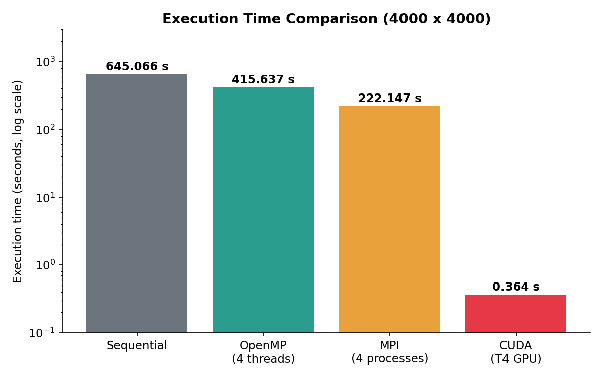
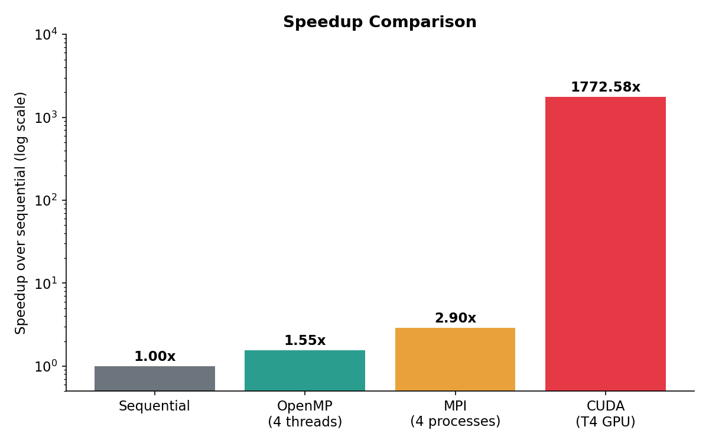
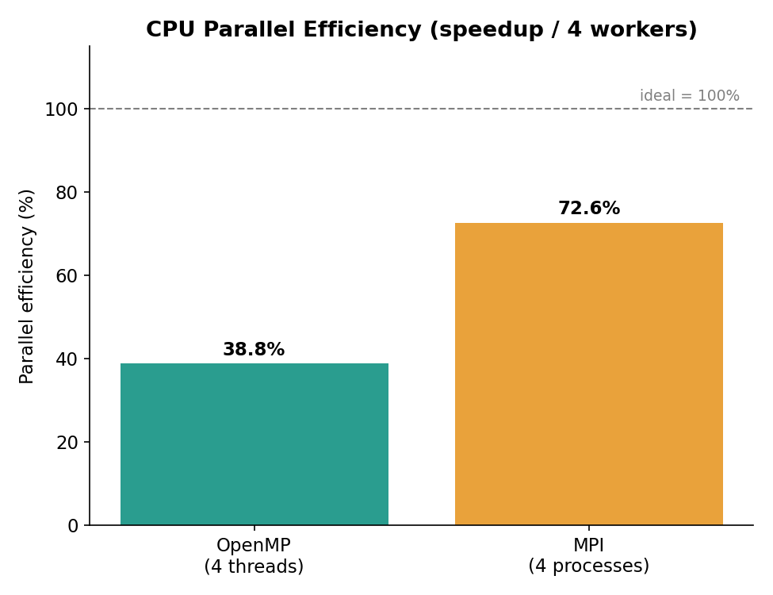
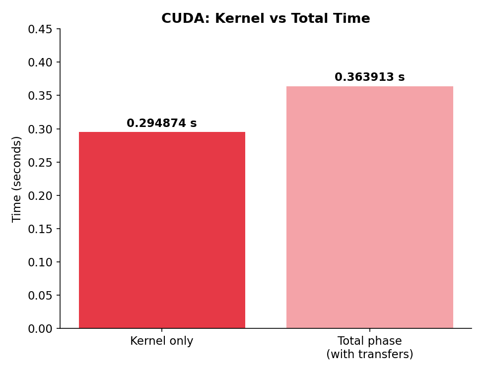
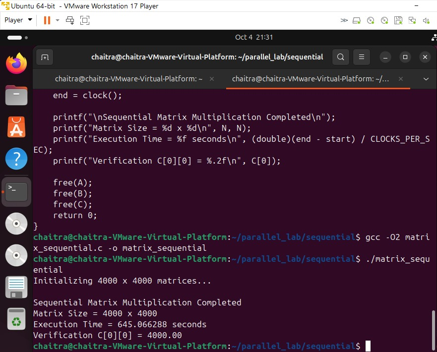
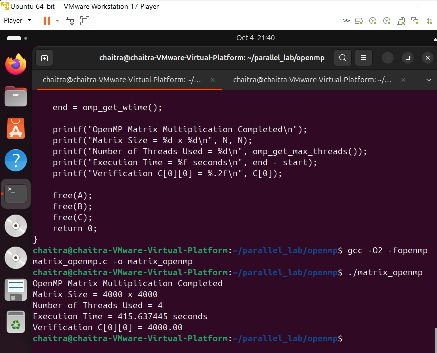
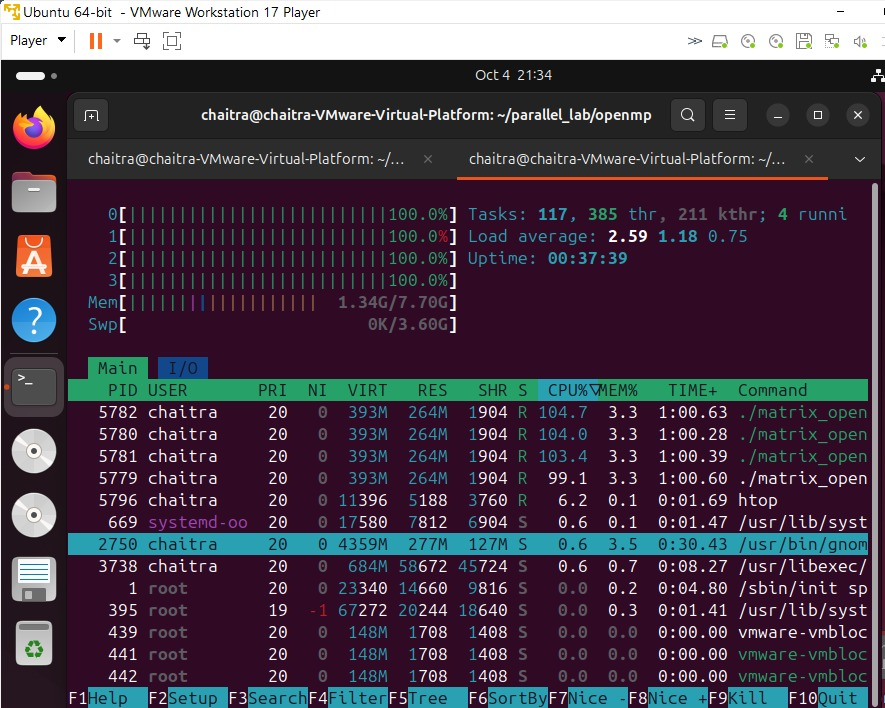
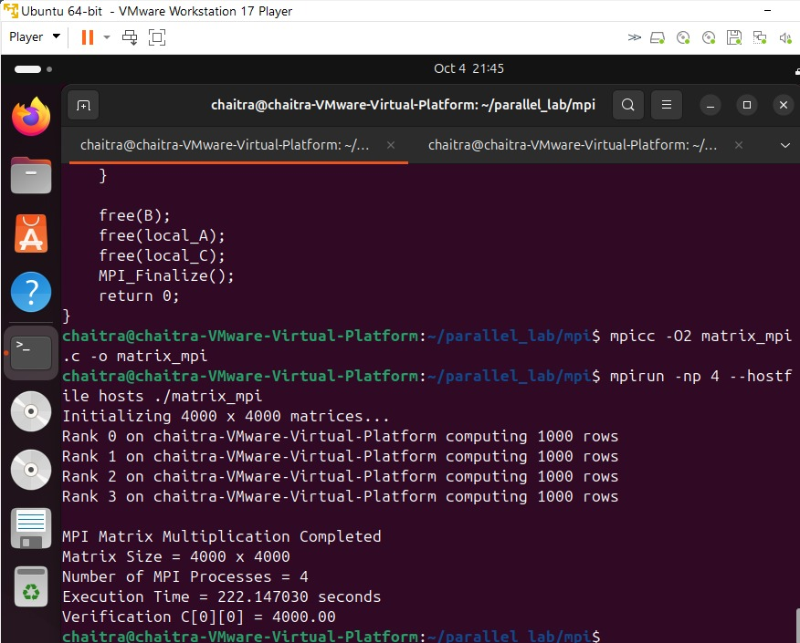
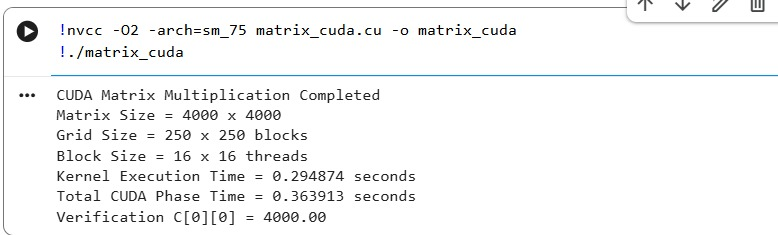

<div align="center">

# ⚡ Experiment 1: Parallel Matrix Multiplication

### Sequential · OpenMP · MPI · CUDA


**Name:** Chaitra &nbsp;|&nbsp; **Roll No:** 253 &nbsp;|&nbsp; **Course:** PG Parallel Computing

</div>

---

## 📌 Aim

To implement the same 4000 × 4000 matrix multiplication using four computing models and compare their performance:

| # | Model | Type of parallelism |
|---|-------|---------------------|
| 1 | Sequential | Single CPU core (baseline) |
| 2 | OpenMP | Shared-memory, multi-threaded CPU |
| 3 | MPI | Distributed-memory, multi-process |
| 4 | CUDA | GPU, massively parallel threads |

**Problem:** A and B are 4000 × 4000 matrices with every element = 1.0. Then `C = A × B`, so every element of C must equal **4000.00**. This is used as the verification check (`C[0][0] = 4000.00`).

---

## 🖥️ Environment

| Item | Details |
|------|---------|
| Host | Windows with VMware Workstation 17 Player |
| Guest OS | Ubuntu 64-bit (VM) |
| CPU (VM) | 4 logical CPUs (`nproc` = 4) |
| Compiler | GCC (`-O2`) |
| OpenMP | `gcc -fopenmp`, `OMP_NUM_THREADS=4` |
| MPI | Open MPI, 4 processes on a single VM (`localhost slots=4`) |
| CUDA | Google Colab, NVIDIA Tesla T4 GPU (`nvcc`, `-arch=sm_75`) |

> **Note:** The reference manual used 4 separate VMs for MPI and an RTX 4500 Ada GPU for CUDA. Here MPI ran as 4 processes on one VM and CUDA ran on a Colab T4, so absolute times differ from the manual.

---

## 📁 Repository Structure

```
EXPT1-PGC/
├── README.md
├── results.txt
├── make_graphs.py
├── sequential/
│   ├── matrix_sequential.c
│   └── output_sequential.txt
├── openmp/
│   ├── matrix_openmp.c
│   └── output_openmp.txt
├── mpi/
│   ├── matrix_mpi.c
│   ├── hosts
│   └── output_mpi.txt
├── cuda/
│   ├── matrix_cuda.cu
│   └── output_cuda.txt
├── graphs/
│   ├── execution_time.png
│   ├── speedup.png
│   ├── efficiency.png
│   └── cuda_breakdown.png
└── screenshots/
    ├── seq.jpeg
    ├── openmp.jpeg
    ├── htop.jpeg
    ├── mpi.jpeg
    └── cuda.jpeg
```

---

## ▶️ How to Compile and Run

```bash
# Sequential
cd sequential
gcc -O2 matrix_sequential.c -o matrix_sequential
./matrix_sequential

# OpenMP
cd openmp
export OMP_NUM_THREADS=4
gcc -O2 -fopenmp matrix_openmp.c -o matrix_openmp
./matrix_openmp

# MPI
cd mpi
echo "localhost slots=4" > hosts
mpicc -O2 matrix_mpi.c -o matrix_mpi
mpirun -np 4 --hostfile hosts ./matrix_mpi

# CUDA (needs an NVIDIA GPU, e.g. Google Colab T4)
cd cuda
nvcc -O2 -arch=sm_75 matrix_cuda.cu -o matrix_cuda
./matrix_cuda
```

---

## 📊 Results

All four implementations produced the correct verification value **C[0][0] = 4000.00**.

| Implementation | Resources | Time (s) | Speedup | Verification |
|----------------|-----------|---------:|--------:|:------------:|
| Sequential | 1 CPU core | 645.066288 | 1.00× | ✅ 4000.00 |
| OpenMP | 4 threads | 415.637445 | 1.55× | ✅ 4000.00 |
| MPI | 4 processes (1 VM) | 222.147030 | 2.90× | ✅ 4000.00 |
| CUDA | Tesla T4 GPU (total phase) | 0.363913 | 1772.58× | ✅ 4000.00 |

**Speedup formula:** `Speedup = Sequential time / Parallel time`

**CUDA detail:**

| Measurement | Time (s) | Speedup |
|-------------|---------:|--------:|
| Kernel only | 0.294874 | 2187.6× |
| Total phase (host→device copy + kernel + device→host copy) | 0.363913 | 1772.58× |

The total phase time is used in the main comparison because it includes the data transfers.

---

## 📈 Performance Graphs

### Execution Time


### Speedup over Sequential


### CPU Parallel Efficiency
Efficiency = speedup / number of workers (4).

| Implementation | Speedup | Efficiency |
|----------------|--------:|-----------:|
| OpenMP (4 threads) | 1.55× | 38.8% |
| MPI (4 processes) | 2.90× | 72.6% |



### CUDA: Kernel vs Total Time


---

## 📷 Screenshots

### Part A: Sequential


### Part B: OpenMP



### Part C: MPI


### Part D: CUDA


---

## 🔍 Observations

1. **Sequential** is the baseline: one CPU flow, 645.07 s.
2. **OpenMP** split the outer loop across 4 threads and `htop` showed all 4 CPUs at 100%, but the speedup was only 1.55×. Likely reasons: the VM's virtual CPUs are shared with the host, other programs were running (htop, browser) during the run, and the inner loop reads `B[k*N+j]` with a large stride, so the program is limited by memory access rather than compute.
3. **MPI** reached 2.90× (72.6% efficiency). Each of the 4 processes computed 1000 rows, with `MPI_Scatter`, `MPI_Bcast` and `MPI_Gather` handling data movement. Because all processes ran on one VM, there was no network cost, only memory-copy and process overhead.
4. **CUDA** was by far the fastest at 1772.58× speedup. The GPU launches 62,500 blocks of 256 threads (16,000,000 logical threads), so each thread computes one output element. About 80% of the total CUDA time is the kernel and the rest is data transfer.
5. Measured results depend on hardware. These numbers come from a 4-CPU VM and a Colab T4, so they differ from the reference manual.

---

## ✅ Conclusion

The same 4000 × 4000 matrix multiplication was implemented using sequential, OpenMP, MPI and CUDA, and every version produced the verified result `C[0][0] = 4000.00`. Execution time fell from 645.07 s (sequential) to 415.64 s (OpenMP), 222.15 s (MPI) and 0.364 s (CUDA). CPU-based parallelism gave modest gains limited by the 4-core VM and memory bandwidth, while GPU parallelism gave a speedup of more than three orders of magnitude, showing why GPUs suit data-parallel workloads such as matrix multiplication.

---

<div align="center">Experiment 1 · Parallel Computing Lab</div>
